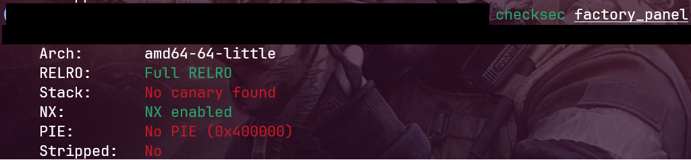
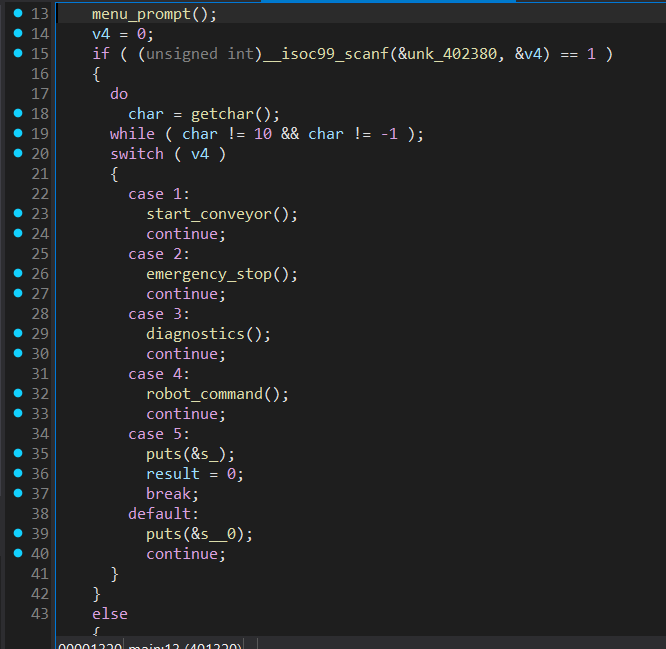
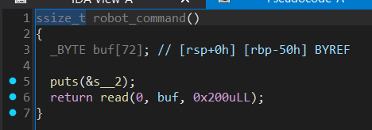

# Factory

|   Cобытие   | Название | Категория |
| :---------: | :------: | :-------: |
|  StudentCTF 2025  |  Factory  |  PWN  |

## Решение

Участникам выдается `ELF` серверного бинаря, прейдем к анализу.



По `checksec` видно, что отсутствует канарейка и рандомизация адресов ,возьмем себе на заметке. Посмотрим фунционал бинаря.





Из всего функционала нас интересует `robot_command()`. В ней очивидное переполнение буфера (на вход принимается 200 байт, размер `buf` - 72) и в условиях отсутствия канарейки и рандомизации адресов функций мы можем приступать к лику libc с последующим вызовом `execve('/bin/sh')`. Изначально ликнем адреса функций `puts()` и `write()` для того чтобы найти версию libc, используемую на сервере (это можно сделать с помощью [libc.rip](https://libc.rip)), высчитаем libc_base, соберем `rop` цепочку, перепишем адрес возрата на `execve('/bin/sh')`. 

Пример эксплойта со всеми вышеописаными действиями в [exploit.py](exploit.py)

### Флаг

```
stctf{industrial_control_panel_pwned_without_problem}
```