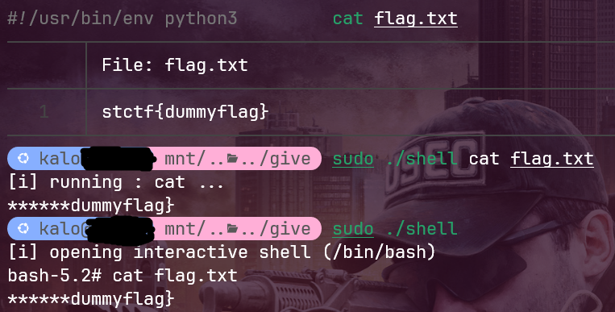
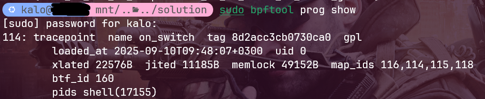
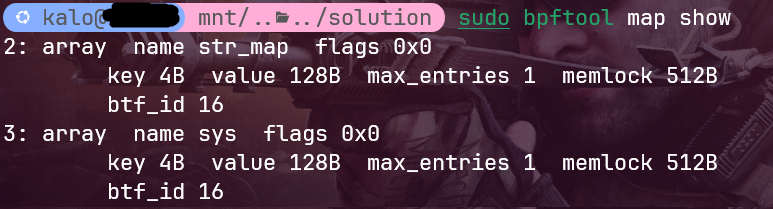

# Flag Hider

|   Cобытие   | Название | Категория |
| :---------: | :------: | :-------: |
|  StudentCTF 2025  |  Flag Hider   |  REV  |

## Описание

> В мире CTF произошла иновация. Теперь таски можно даже не решать, нам выдали новый шелл, через который просто cat'аешь `flag.txt` и всё, флаг в руках. Почти...
>

## Решение

Участникам выдается ELF `shell`, у которого есть два пути использования. При обычном запуске `sudo ./shell` запускается интерактивный шелл, в котором при чтении файла `flag.txt`, если символы в файле совпадают с символами флага, то они меняются на `*`. Второй вариант - запуск через `sudo ./shell cat flag.txt`, в котором так же выводится маскированный вывод.



Перейдем к анализу. При статическом анализе функции `main` можно неоднократно заметить упоминания `bpf` -> можно сделать вывод, что программа использует `eBPF` для хука syscall и подмены выводимых на экран символов. С этой точки мы встаем на распутье трех вариантов решений данного задания.

### Вариант 1 (самый логичный и легкий)

Если бинарь запускает `bpf` программу, то мы можем сдампить ее и проанализировать. Для этого воспользуемся утилитой `bpftool`

При запущенном шелле, посмотрим список подгруженных `bpf` программ командой `sudo bpftool prog show`



В моем случае, `bpf` программа под `id=114`. Сдампим её с помощью команды `sudo bpftool prog dump xlated id 114 opcodes > on_switch.xlated`. Просмотрев дисасм, заметим, что здесь находиться логика для передачи символов для хука системным вызовам и `xor` двух частей, из которых эти символы и берутся. Эти две части лежат в картах `bpf`, просмотрим их с помощью команды `sudo bpftool map show`



А вот и эти две карты. Остается дело за малым, сдампить их и проксорить.

Решение представлено на языке [Python](solve.py).

### Вариант 2 (без bpf)

Программа имеет внутри себя зашифрованный `elf blob` `bpf` программы. Теортически, можно сдампить эту программу динамчески и уже разбираться с её логикой работы, однако я не вижу в этом никакого смысла, когда есть более легкий и быстрый способ. Однако, никто такого способа решения не отменял

### Вариант 3 (брут)

Возможно применить брут флага, так как совпадающие символы заменяются на `*`. Пример брута в [solve_brute.py](solve_brute.py)

### Флаг

```
stctf{eBPF_1s_n0t_4S_c0Mpl1cat3d_4s_iT_s33ms_4t_f4rst_gl4nc3}
```
