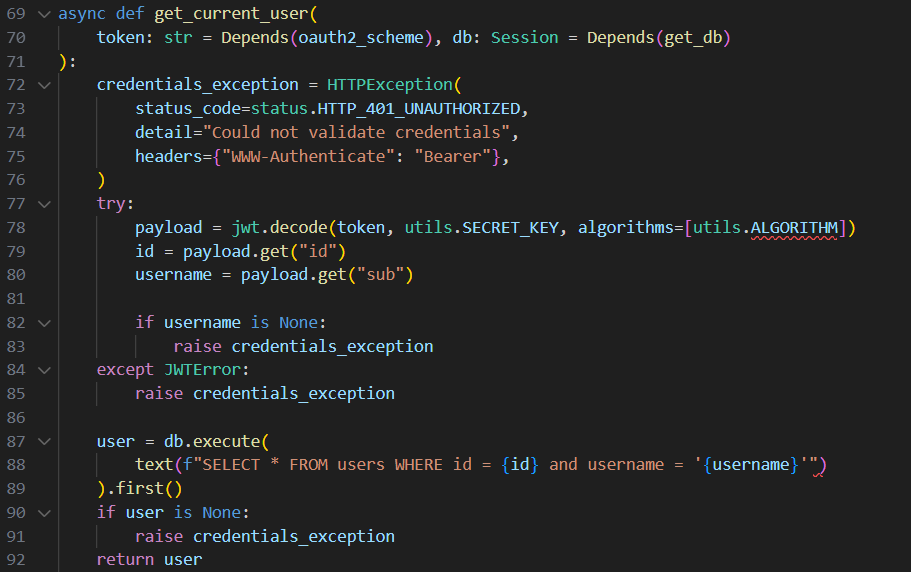

## Gif Manager

| Событие         | Название     | Категория |
| :-------------- | ------------ | --------- |
| StudentCTF 2025 | Gif Manager | MISC       |

  
### Описание

> Gif Manager - это приложение для управления коллекцией GIF-изображений с удобным интерфейсом поиска, фильтрации и организации анимаций.

### Решение

Нам даны исходники веб-сервиса и публичный ключ RSA. Начинаем изучать сервис. Можем создать аккаунт и войти в него. В профиле можно загрузить файл формата gif, а потом случайно встретить его при нажатии на кнопку "Get Random GIF". Также можно посмотреть небольшую информацию о своем профиле.

Изучаем исходники, находим файл init.sql, в котором явно указано, что флаг лежит в БД. Значит где-то в сервисе есть SQL-инъекция, потому что явного вызова данных из таблицы с флагом нет в исходном коде. Находим такую интересную функцию:




Где явно видно, что id и username подставляются как форматная строка, а это явный намек на SQL-инъекцию. Но вот незадача, эта функция берет данные из OAuth токена формата JWT, а самый явный вызов только этой функции в /api/profile:


Также мы не знаем прямой вывод запроса, значит имеем дело со слепой инъекцией.

Так как же получить доступ к токену? Обратим внимание, что в файле utils.py используется алгоритм RS256 для подписи и сверки токена. А для RS256 используется закрытый и открытый ключи RSA, которые были сгенерированы перед началом запуска сервиса в файле entrypoint.sh:
python3 generator/main.py -o ./ -bl 2048 -d 22

Открываем исходный код генератора, изучаем его и получаем уравнение для N:

```
N = p * (a * p + b)
N = a * p^2 + b * p

a * p^2 + b * p - N = 0
```

Получаем квадратное уравнение. Тут можно воспользоваться [RsaCtfTool](https://github.com/RsaCtfTool/RsaCtfTool) или решить его самому. Для этого определим дискриминант:

```
D = b^2 + 4 * a * N = t^2

```
Так как t является целым числом, а 4 * a * N очень велико по сравнению с b, то делаем вывод, что t = int_sqrt(4 * a * N) + 1. А для получения точных значений необходимо перебрать 22-битные простые числа, коих не так уж и много. Находим t, возводим t в квадрат и вычитаем 4 * a * N, то есть t^2 - 4 * a * N = квадрату целого числа.

Таким нехитрым способом находим a и b, а затем корень квадратного уравнения p, который будет являться множителем N. После получаем закрытый ключ для RSA. Теперь можем создавать JWT токен с любой нагрузкой внутри. Тут уже начнем перебирать буквы флага таким запросом:

```
"username' AND '{letter}'=(SELECT SUBSTRING(flag, {position}, 1) from secret LIMIT 1) -- q"
```
Вместо letter подставляем символы из string.printable.

Решение представлено на языке [Python3](sploit.py)

### Флаг

```
stctf{test_flag}
```
