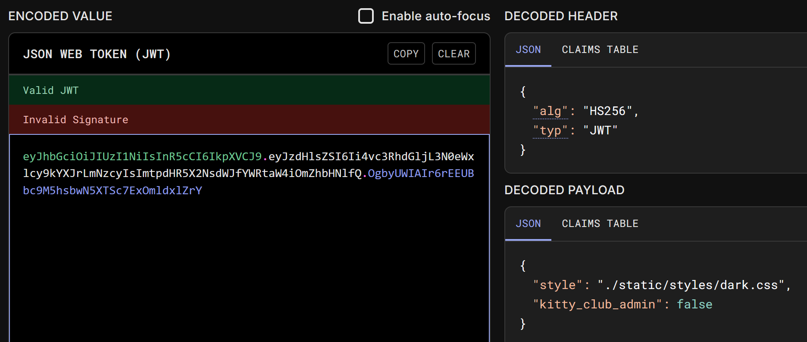

# Kitty Club

|   Cобытие   | Название | Категория |
| :---------: | :------: | :-------: |
|  StudentCTF2025  |  Kitty Club   |  WEB  |

## Описание

>Что может быть лучше, чем картинки с котами? Верно - ничего! Вступай в наш кошачий клуб и убедись в этом сам)
>

## Решение

- Функционал сервиса до жути прост, есть всего одна доступная пользователю функция, позволяющая сменить стиль страницы.

- Смотрим в burp, видим, что при смене темы мы можем контролировать файл сервера, который будет подгружаться как стиль


- Далее сервер ставит нам в куку JWT и перенаправяет обратно на начальную страницу. Смотрим, что есть в JWT


- Итак, проверяем стандартные директории LFI. Однако `/etc/passwd`, `/proc/self/environ`, `etc/hosts` ничего нам не возвращают, однако сами стили из `./static/styles/` подгружаются, видимо мы можем загрузить файл не выше, чем из текущей директории.

- Обратим внимание на заголовок ответа `Server: Werkzeug/3.1.3 Python/3.11.13`. Значит, скорее всего, наше приложение написано на Python.

- Пробуем найти код самого приложения, что-то вроде `main.py` или `app.py`.

- И в ответе, между base64 data URI картинками, на месте стилей видим исходный код приложения


- Читаем сорцы и видим, что для получения флага нам нужно перейти на ручку `/kitty_club_admin` с параметром `"kitty_club_admin": true`

- Это не составляет труда, ведь в сорцах мы также нашли захардкоженный секрет JWT.

- Любым способом подписываем наш новый JWT с нужным пэйлоадом и забираем флажок со страницы.

### Флаг

```
stctf{Sup3r_s3cRe7_cUt3_K1tTy_CluB}
```