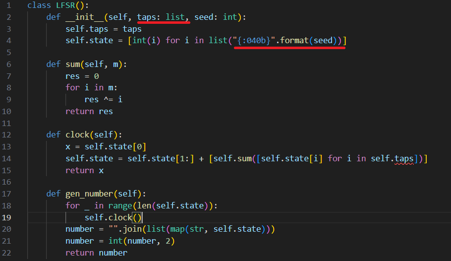
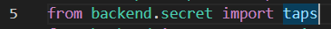
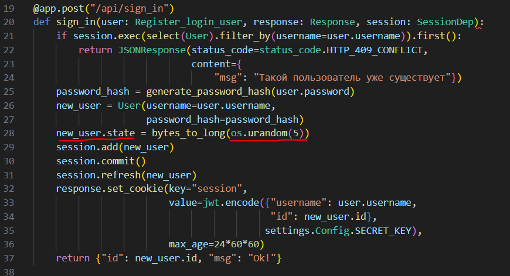
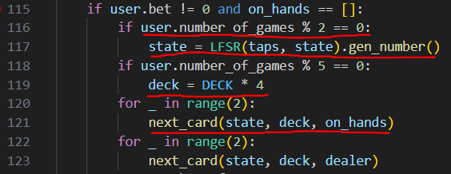
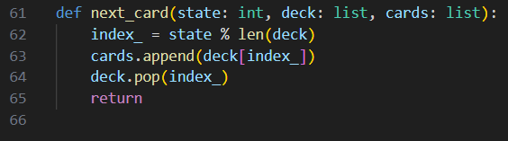
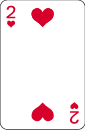
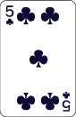
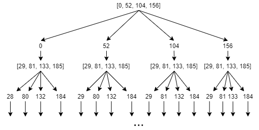

# Lucky Duck Casino

| Событие         | Название     | Категория |
| :-------------- | ------------ | --------- |
| StudentCTF 2025 | Lucky Duck Casino | CRYPTO       |

## Описание

>Выходит как-то Месси расстроенным из казино, проиграв все деньги, а навстречу ему Берлекэмп, а он и говорит: "Пошли покажу, как это делается".


## Решение

Начинаем изучать сервис. Нам доступна авторизация и игра в блэкджек примерно как в казино. Из кода становится ясно, что флаг будет дан при балансе больше 1000000, но изначально у нас есть только жалкая 1000. Причем ставки можно делать только от 50 до 7500, но начинать подниматься с 1000 достаточно трудно, тем более, что рандом достаточно хороший на первый взгляд. Поэтому заглянем под капот.

А там у нас классический LFSR (регистр сдвига с линейной обратной связью):




Причем из start.py выходит, что taps неизвестны, как и начальные состояния, которые всего 5 байт, это видно в auth.py:





Но на этом еще не все, ведь это всего лишь генерация состояний, а не самих карт. Найдем в коде, как используются эти состояния:





Получается, состояния обновляются каждые 2 игры, все состояния 40 битные, карты генерятся при взятии состояния по модулю длины колоды, но вот незадача, ведь колода состоит не из 52 упорядоченных карт, а аж из 208 карт! (119 строчка main.py).

4 колоды мешают просто восстановить несколько состояний генератора через [Китайскую теорему об остатках](https://ru.wikipedia.org/wiki/%D0%9A%D0%B8%D1%82%D0%B0%D0%B9%D1%81%D0%BA%D0%B0%D1%8F_%D1%82%D0%B5%D0%BE%D1%80%D0%B5%D0%BC%D0%B0_%D0%BE%D0%B1_%D0%BE%D1%81%D1%82%D0%B0%D1%82%D0%BA%D0%B0%D1%85), так как с одной колодой мы бы наверняка знали остатки состояний по разным модулям (меняющаяся длина колоды).

Но на самом деле, это не помеха, даже при таком раскладе можно и нужно применить Китайскую теорему об остатках, но это будет сделать сложнее.

Просто теперь мы не знаем, какая именно из 4 карт выпала в игре, но мы имеем все индексы этих карт, даже с учетом сдвигов. То есть, например, первая карта выпала: 



или 2-h в колоде в main.py. Её 4 индекса в четверной колоде это [0, 52, 104, 156], то есть наше неизвестное state имеет один из этих остатков по модулю 208. А следующая карта выпала такая:



или 5-c в колоде. Её 4 индекса уже будут [29, 81, 133, 185] в изначальной колоде, но теперь для каждого индекса нужно учесть изъятие предыдущей карты, чтобы получить остатки по модулю уже 207. При этом индексы будут сдвигаться на то количество карт, которые были до этого индекса, после этого индекса карты на него не влияют (это очень хорошее замечание для реализации). 

Попробуем составить примерное дерево возможных остатков:



Как видно из дерева, уже после двух карт мы получаем 16 возможных состояний, соответственно для восстановления 40-битного исходного состояния необходимо минимум 7 карт, что соответсвует 4^7 = 2^14 = 16384 возможных состояния, которые восстанавливаем по Китайской теореме об остатках и проверяем по еще 2-3 следующим картам, чтобы найти верное state из этих возможных 16384.

Но на этом решение не заканчивается, так как помимо восстановления нескольких state необходимо узнать следуюшие state генератора на LFSR. На самом деле, это даже сделать проще, чем восстановить эти state, так как тут классическая атака на LFSR - [алгоритм Берлекэмпа — Мэсси](https://ru.wikipedia.org/wiki/%D0%90%D0%BB%D0%B3%D0%BE%D1%80%D0%B8%D1%82%D0%BC_%D0%91%D0%B5%D1%80%D0%BB%D0%B5%D0%BA%D1%8D%D0%BC%D0%BF%D0%B0_%E2%80%94_%D0%9C%D1%8D%D1%81%D1%81%D0%B8). Основа его достаточно проста, так же как и вызов его в python3 из sagemath:

```python3
from sage.matrix.berlekamp_massey import berlekamp_massey
from sage.all import GF

binary_stream = [GF(2)(0), GF(2)(1), GF(2)(1), ..., GF(2)(0)]
print(berlekamp_massey(binary_stream))
```

Для взлома 40-битного генератора LFSR, на самом деле, достаточно всего 2 восстановленных state, после чего получим такое уравнение:

x^40 + x^23 + x^21 + x^18 + x^16 + x^15 + x^13 + x^12 + x^8 + x^5 + x^3 + x + 1

А секретный taps это: [0, 1, 3, 5, 8, 12, 13, 15, 16, 18, 21, 23] (просто берем ненулевые коэффициенты кроме x^40 согласно тому, что мы убираем каждый раз самый первый бит при вычислении следующего в LFSR).

А дальше дело техники (хотя не самая легкая часть, поэтому в качестве помощи был дан скрипт client_new.py) - это автоматизировать взаимодействие с сервисом для поднятия баланса до 1 млн., тут разные стратегии можно придумать, так как теперь мы можем предсказывать абсолютно все карты, поэтому можем менять свою стратегию на лету, главное не промахнуться с массивом текущих карт, иначе неправильное отслеживание будет ломать все решение. 

Также перебор state может допускать брутфорс на "быстром" языке, например, на C/C++, так как state всего 2^40 = 1099511627776, хотя и тут надо постараться, чтобы это сделать.:\)

Решение представлено на языке [Python](sploit/sploit.py).

### Флаг

```
stctf{blackjack_is_super_cool_game!}
```