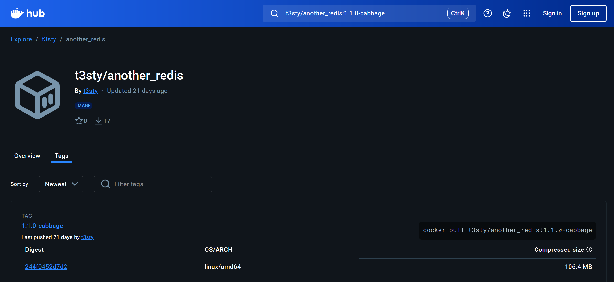
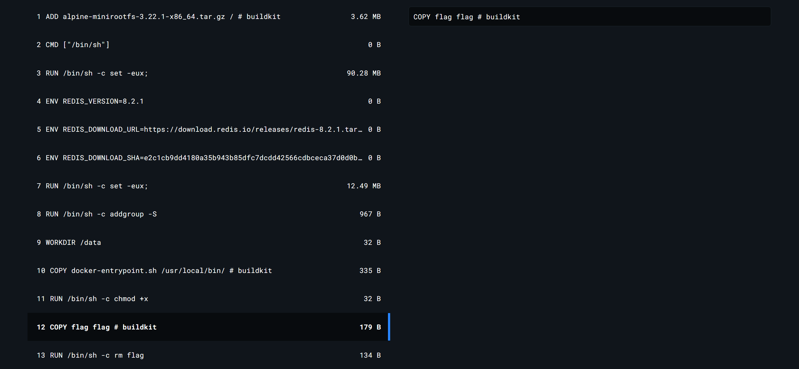
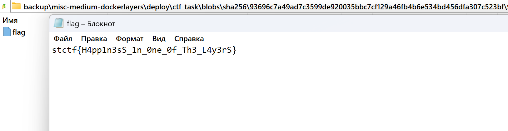

# Strange-cabbage

|   Cобытие   | Название | Категория |
| :---------: | :------: | :-------: |
|  StudentCTF2025  |  Strange-cabbage   |  MISC  |

## Описание

>Наконец-то разработчики выкатили студенческий чат! Теперь можно анонимно в реальном времени обсуждать преподавателей и шарить друг другу решение домашки!  
>

## Решение

- Начинаем изучать сервис и через какое-то время понимаем, что в небольшом коде ничего особо интересного нет.
- Тогда идём смотреть `Dockerfile` и `docker-compose.yml`, в надежде найти там что-то необычное.
- Всё вроде стандартно, но замечаем образ redis со странным названием `image: t3sty/another_redis:1.1.0-cabbage`.
- идём на `hub.docker.com` и находим наш образ.



- открываем его единственный тэг и, просматривая слои, замечаем в образе `COPY flag flag # buildkit` и следующем же слоем `RUN /bin/sh -c rm flag`.



- Получается, что в наш образ был добавлен флаг, но потом сразу же удалён, однако, мы всё равно можем посмотреть его содержимое.

- После этого шага существует множество вариантов решения, например использование различных утилит для работы с docker слоями, но можно сделать и ручками, используя `docker save`.

- Итак, пуллим себе образ с dockerhub, сохраняем как архив:
```bash
docker save -o ctf_task.tar t3sty/another_redis:1.1.0-cabbage
``` 
распаковываем, смотрим в manifest.json, в котором указывается, в каком файле находится конфигурация и перечисляются все слои образа.

- Далее в директории `blobs/sha256` находим нужный нам слой с флагом, открываем как архив и получаем желаемое)


 
- P.S. Примерный процесс можно найти на [просторах интернета](https://habr.com/ru/companies/otus/articles/859256/)


### Флаг

```
stctf{H4pp1n3sS_1n_0ne_0f_Th3_L4y3rS}
```
