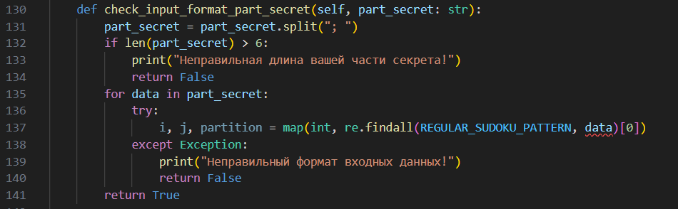

# Sudocular-Oracular

| Событие         | Название     | Категория |
| :-------------- | ------------ | --------- |
| StudentCTF 2025 | Sudocular-Oracular | CRYPTO       |

## Описание

>Как вы думаете, что будет, если создать схему разделения секрета на основе Судоку? Предлагаем вам вместе с нами разделить секрет, а затем вновь объединиться!

## Решение

Подключаемся к сервису, наблюдаем схему разделения секрета на судоку, нам предоставляют зашифрованный AES-CBC флаг, на данный момент сделать с ним ничего не получится, так как нам нужна матрица из 81 ячейки, известно всего 6.

Исследуя исходный код, выясняем следующее:

1. Схема разделения секрета на судоку по сути делит известные 30 ячеек для судоку рандомно на 5 частей по 6 ячеек, забрутить или как-то на данный момент остальные ячейки не представляется возможным, решить судоку также нереально на основе всего 6 ячеек, так как количество решений даже сосчитать сложно.

2. Нам дано 130 попыток для проверки общего секрета, если все правильно, нам возвращается начало флага, если нет, нам возвращается сообщение об ошибке.

3. Решение судоку нам не дано, придется искать самостоятельно, скорее всего, оно понадобится для решения.

На основе 2 пункта можно предположить, что смысл таска заключается в оракуле, как-то надо узнать правильные ячейки матрицы и решить судоку, но попыток подозрительно не много, но и не мало. Также посмотри подробно на ввод нашей части секрета:



Интересно, что длина нашей части секрета должна быть не больше 6, что значит, что можно убрать ячейки, и наш секрет добавляется последним, а значит также есть возможность переписывать ячейки других частей секрета. Что все это нам дает?

А это все позволяет воспользоваться оракулом в своих целях. Одна из особенностей судоку в том, что при попытке изменить почти любую известную ячейку решить судоку не получится, оно либо не будет иметь решений, либо их станет несколько, что противоречит уcловию единственности решения судоку.

Теперь план рещения такой:

1. Делаем несколько обращений к оракулу, в которых убираем по очереди одну из наших известных ячеек (это необходимо сделать, чтобы понять, исключение какой нашей ячейки не влияет на решаемость судоку) и запоминаем индекс.

2. Генерируем рандомно массив из примерно 20-25 индексов, которые будем брутить (дело в том, что не получится просто последовательно узнать ячейки матрицы, а потом искать решение судоку, так как смысл генерирования судоку заключается в поиске оптимального разброса известных ячеек, чтобы можно было однозначно его потом решить) (также успех во многом будет зависеть от удачного рандома)

3. Используя индекс из 1 пункта и массив из 2 пункта начинаем последовательный брут значений ячеек от 1 до 9. (130 попыток как раз примерно и рассчитано на нахождение 25 ячеек матрицы)

4. Находим примерно 10,000 решений судоку, их вполне может быть меньше, поэтому необходим алгоритм нахождения ВСЕХ решений судоку, а не одного. 

5. Ищем подходящее нам решение, расшифровывая зашифрованный флаг.

Решение представлено на языке [Python](sploit.py).

### Флаг

```
stctf{only_an_oracle_helped_break_the_secret_sharing_scheme_on_sudoku}
```