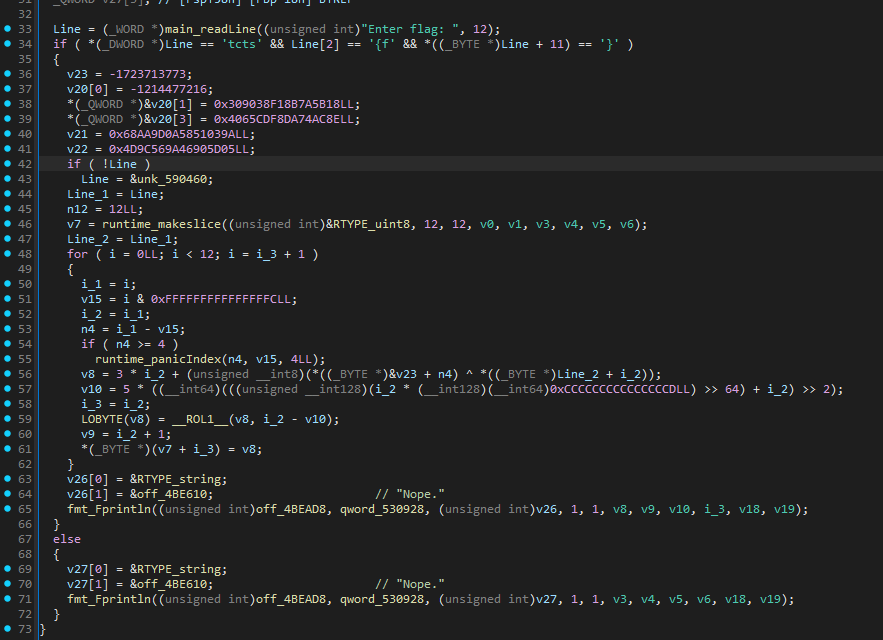

# Warmup

|   Cобытие   | Название | Категория |
| :---------: | :------: | :-------: |
|  StudentCTF 2025  |  Warmup  |  REV  |

## Описание

> Это всего лишь разминка. 
>

## Решение

Участникам выдается `ELF`, написанный на языке `GO`, в котором реализованно стандартное для любого crackme функционал.



Как видно, все до жути просто. Чтение ввода, сверка начала `stctf{` и окончания `}`, затем оставшаяся часть сдвигается побайтово и ксориться с ключом `\x13\x37\x42\x99`. Остается лишь совершить обратные действия со сверяемой строкой.

Пример решения в [solution.py](solution.py)

### Флаг

```
stctf{its_only_a_warmup_keep_it_up!}
```