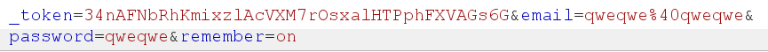
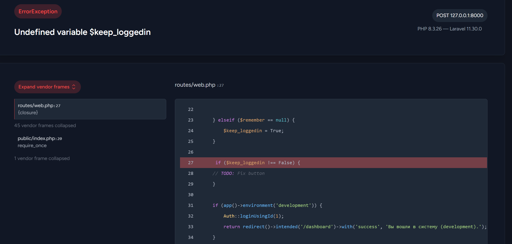
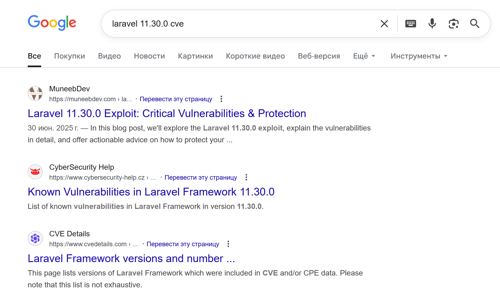
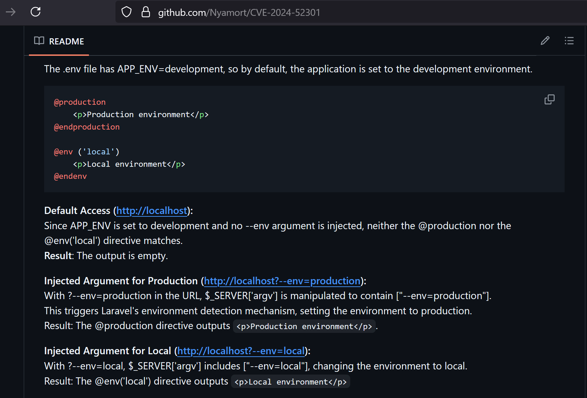
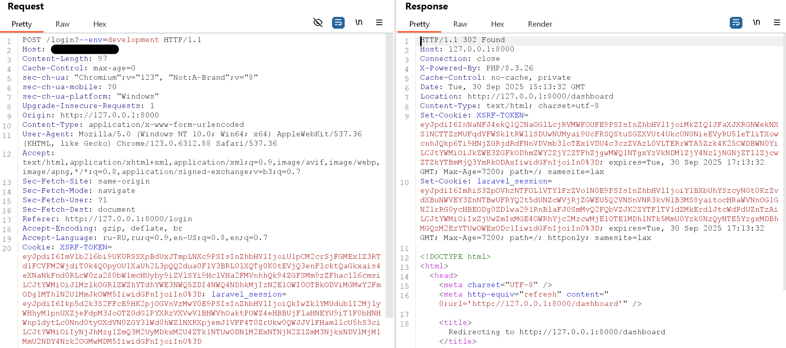

# Yet another site

|   Cобытие   | Название | Категория |
| :---------: | :------: | :-------: |
|  StudentCTF2025  |  Yet another site   |  HTB  |

## Описание

>Сидишь, сёрфишь себе в интернете и вдруг находишь с виду обычный сайт...  
>

## Решение

- Совсем немного побрутив директории, находим /login.

- Пробуем залогиниться, с какими-нибудь дефолтными кредами - ничего.

- Идём в burp, видим, что мы передаём параметр `remember` , если нажали `Запомнить меня`.


- Пробуем подставить любое другое значение, кроме `on` ловим запрос и видим 500 ошибку на странице debug laravel.


- Тут же сразу видим версию `laravel` - `11.30.0` и часть исходного кода страницы.

- Узнаём, что версия уязвима, находим PoC `CVE-2024-52301`




- Из debug страницы видим, что если среда приложения - `development` - мы автоматом логинимся и нас редиректит на `/dashboard`.

- Пробуем залогиниться с параметром `?--env=development`. 


- Успешно заходим на `/dashboard` и забираем флаг!


### Флаг

```
stctf{Lo0k_4t_7h3_b3auTy_tH4t_SurR0uNds_y0u}
```