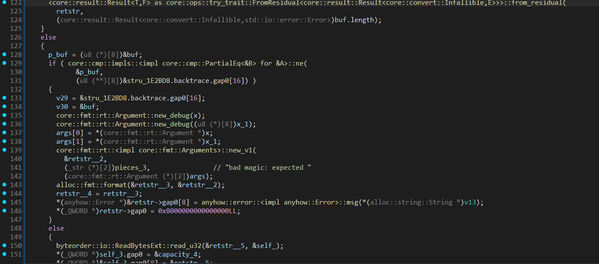
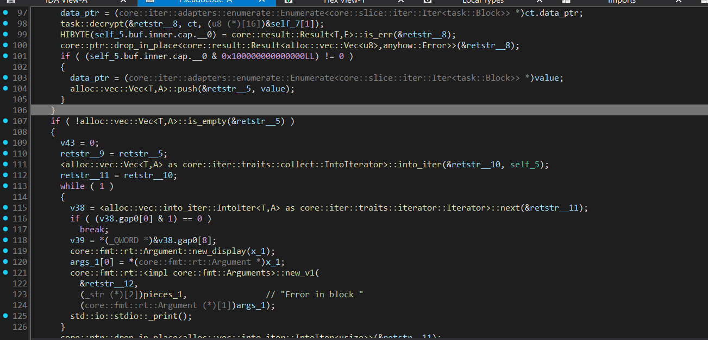
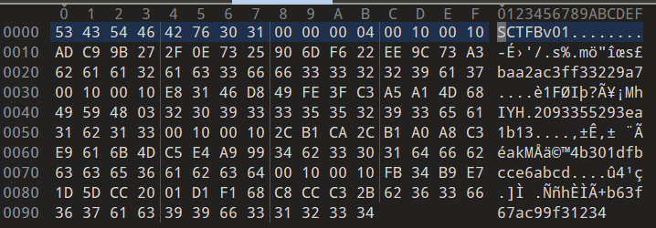

# Поломанный

|   Cобытие   | Название | Категория |
| :---------: | :------: | :-------: |
|  StudentCTF 2025  |  Поломанный  |  REV  |

## Описание

> Оу, этот формат файла я еще никогда не видел. Его кто-то еще поломал... 
>

## Решение

Участникам выдается видеоролик, в котором видно, что в файле `challenge.sc` переписали 4 байта со сдвигами `0x78` и `0x94` и теперь он не проходит проверку чекера. Перейдем к анализу самого чекера.

В функции `main` в самом начале происходит проверка `input_file` в функции `task::Container::read_from_file()`. Изначально проверяется 8 байт - `magic`, затем проверяется количество блоков и их корректность (их должно быть до 16 и не 0 блоков). Каждый блок: `header_len == 16`, `payload_len > 0`, `payload_len % 16 == 0`, затем строгое чтение `payload_len` и ещё `16` байт “хвоста”. Несоответствие любому из условий или ошибка чтения -> `anyhow::Error`



Затем после валидации блоков, происходит попытка их расшифрования в функции `task::decrypt`. Немного пробежавшись по ней можно заметить множественные импорты библиотеки `aes`, а именно функционала для использования `ecb` режима, что подверждается проркой блоков длиной 16 байт -> перед нами ни что иное, как `aes-ecb-128`.



Перейдем к разбору файла формата `.sc`



Как мы видим, первые 8 байт - `magic header`, затем идет количество блоков `00 00 00 04` и наконец сами блоки. Изначально заголовок с длиной шифртеска и ключа, а затем уже они сами. Как мы видели в видеоролике, у нас перетерты ключики для двух блоков, а два корректные, то есть остается лишь перебрать их, пока не получим валидные ключи и два оставшихся куска флага

Пример решения в [solution.py](solution.py)

### Флаг

```
stctf{aes_ecb_keys_are_not_fun_when_exposed}
```